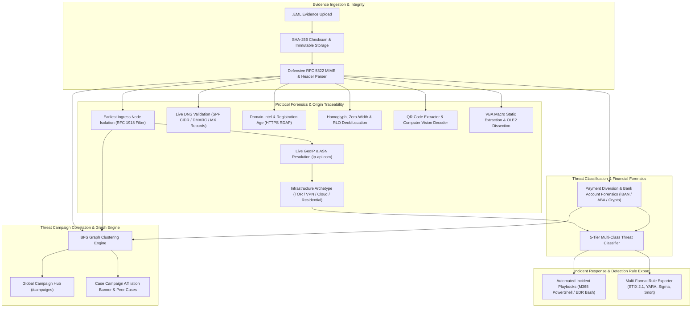

# MailRecon AI


**Next-Generation AI-Powered Email Threat Detection, Geolocation, Protocol Forensics & Campaign Correlation Platform**

MailRecon is a production-grade digital forensics and incident response platform designed for SOC analysts, incident commanders, and fraud examiners to ingest, dissect, triage, correlate, and contain sophisticated email-borne attacks.

---

## High-Level Architecture



---

## Core Capabilities

### 1. Origin Traceability & Geolocation Intelligence
- **Earliest Reliable Ingress Node**: Traverses `Received` header chains backward from boundary MTAs, discarding internal unroutable RFC 1918 hops to pinpoint the public gateway that introduced the message into global transit.
- **Live GeoIP & ASN**: Queries live geolocation APIs with in-memory caching and offline emergency fallbacks.
- **Infrastructure Archetype Tagging**: Automated heuristic classification into `TOR_EXIT`, `VPN_PROXY`, `CLOUD_HOSTING`, `RESIDENTIAL_BROADBAND`, `ENTERPRISE_RELAY`, and `PRIVATE_LAN`.
- **Live Protocol Authentication**: Queries authoritative nameservers in real-time to perform SPF CIDR verification, DMARC enforcement policy queries, RFC 7489 identifier alignment, MX presence checks, and Message-ID RFC 5322 compliance.
- **Domain Registration Intelligence**: Direct HTTPS RDAP querying providing exact domain age in days and highlighting newly registered domains (<30 days).

### 2. Multi-Class Threat Classification
Automatically classifies incidents into 6 primary operational archetypes with percentage confidence scores, ranked secondary classes, and full explainability matrices:
1. **`CREDENTIAL_PHISHING`**: Login lures, phishing link redirectors, Quishing QR vectors.
2. **`MALWARE_DELIVERY`**: Weaponized OLE2/VBA macro attachments, executable camouflage.
3. **`CEO_IMPERSONATION`**: Executive display name spoofing, high-pressure authority coercion.
4. **`PAYMENT_DIVERSION`**: BEC wire account modifications, invoice discrepancies.
5. **`SPAM_RECONNAISSANCE`**: Marketing harvesters, opt-out beacons, burner infrastructure.
6. **`LEGITIMATE`**: Benign business correspondence with clean authentication.

### 3. Payment Diversion & Wire Fraud Forensics
- **ISO 7064 mod-97 IBAN Validator**: High-speed mathematical verification of international bank account numbers.
- **Federal Reserve 9-Digit ABA Routing Checksum**: Weighted arithmetic validation (`(3(d1+d4+d7) + 7(d2+d5+d8) + 1(d3+d6+d9)) mod 10 == 0`).
- **SWIFT / BIC & Cryptocurrency**: Normalization and extraction of SWIFT routing codes, Bitcoin (Legacy, SegWit), and Ethereum addresses.
- **Vendor Impersonation Discrepancies**: Flags discrepancies when standard invoice terminology or enterprise vendor names (e.g. Microsoft, Dell, Google) are transmitted from mismatched domains.

### 4. Automated Incident Response Playbooks
Generates operational containment workflows structured across four core operational pillars:
- **`EMAIL_GATEWAY`**: Tenant-wide message purge commands (Exchange Online PowerShell `New-ComplianceSearchAction -Purge` / Google Workspace CLI) and transport rules.
- **`ENDPOINT_EDR`**: Recipient host network isolation, memory dumps, process tree inspection, and attachment SHA-256 quarantining.
- **`IDENTITY_IAM`**: Microsoft Entra ID / Azure AD credential resets (`Revoke-AzureADUserAllRefreshToken`), OAuth token revocation, and MFA step-up.
- **`FINANCIAL_COMPLIANCE`**: SWIFT wire recall requests, bank anti-fraud desk escalation, and out-of-band vendor verification.
- **Interactive Checklists**: Analysts can mark containment steps as completed directly in the UI.

### 5. Multi-Format SIEM, EDR & IDS Rule Exporter
- **STIX 2.1 JSON**: OASIS standard Cyber Threat Intelligence bundles containing indicators, observed-data objects, and ATT&CK tactic mappings.
- **YARA (.yar)**: Syntactically valid text rules targeting header structures, email subjects, and binary attachment signatures.
- **Sigma (.yml)**: Standardized SIEM detection rule for mail transport logs and web proxy telemetry (translatable to Splunk, Sentinel KQL, and Elastic).
- **Snort / Suricata (.rules)**: Network intrusion detection signatures targeting outbound C2 connections or phishing domains.

### 6. Cross-Case Threat Campaign Correlation Engine
- **Graph Clustering (BFS)**: Uses Breadth-First Search connected components across all historical cases to correlate attacks sharing:
  - Bank Accounts (IBAN) & Routing Numbers (ABA)
  - Cryptocurrency Wallet Addresses
  - Malicious Attachment SHA-256 Hashes
  - Specific Attacker Domains & Reply-To Mailboxes (filtering out generic webmail providers)
  - Originating Ingress IPs
- **Global Campaign Hub (`/campaigns`)**: Dedicated dashboard for monitoring multi-case campaigns, attack duration, risk metrics, and shared anchor IOCs.
- **Interactive SVG Topology**: Force-directed visual graph illustrating cases clustered through shared infrastructure and financial nodes.
- **Case Affiliation Alerts**: Highlights linked campaign context on individual case views with links to peer cases.

---

## Quick Start (Docker)

1. Clone repository and setup environment:
   ```bash
   git clone https://github.com/Im-manojkumar/MailRecon.git
   cd Mail-Recon
   cp .env.example .env
   ```

2. Start the entire platform with Docker Compose:
   ```bash
   docker compose up --build
   ```

3. Open the web interface:
   - **Frontend**: [http://localhost:3000](http://localhost:3000)
   - **API Docs (Swagger UI)**: [http://localhost:8000/docs](http://localhost:8000/docs)

4. Seed demo forensic evidence and campaigns:
   ```bash
   # From your backend environment or docker container:
   cd backend
   python -m scripts.seed_demo_cases
   ```
   **Default Credentials:**
   - **Email:** `analyst@mailrecon.local`
   - **Password:** `Password123!`

---

## Local Development Setup

### Backend (Python 3.11+)
```bash
cd backend
python -m venv .venv
# Windows:
.venv\Scripts\activate
# Linux/macOS:
source .venv/bin/activate

pip install -e ".[dev]"
uvicorn app.main:app --host 0.0.0.0 --port 8000 --reload
```

### Frontend (Node.js 18+)
```bash
cd frontend
npm install
npm run dev
```

---

## Verification & Testing

MailRecon maintains 100% test pass coverage across all modules:

```bash
# Run complete pytest test suite:
pytest backend/tests/ -v

# Run frontend TypeScript type checking:
cd frontend
npx tsc --noEmit
```

### Test Coverage Highlights:
- `test_financial_fraud.py`: IBAN mod-97, ABA routing checksums, crypto wallets.
- `test_threat_classifier.py`: 5-tier threat categorization logic and confidence scoring.
- `test_infra_tagger.py`: Infrastructure archetype classifications (Tor, VPN, Cloud, Residential).
- `test_origin_tracing.py`: Ingress node filtering and clock skew detection.
- `test_dns_validator.py`: SPF, DMARC, MX, and RFC 5322 Message-ID validation.
- `test_domain_intel.py`: RDAP registration age and domain age heuristics.
- `test_playbook_generator.py`: Playbook generation across all 4 operational pillars.
- `test_ioc_exporter.py`: STIX 2.1, YARA, Sigma, and Snort rule generation syntax.
- `test_campaign_clusterer.py`: Multi-case BFS graph clustering and generic domain exclusion.
- `test_campaign_api.py`: Campaign listing, graph topology, and case affiliation endpoints.

---

## License

This project is licensed under the MIT License - see the [LICENSE](LICENSE) file for details.
