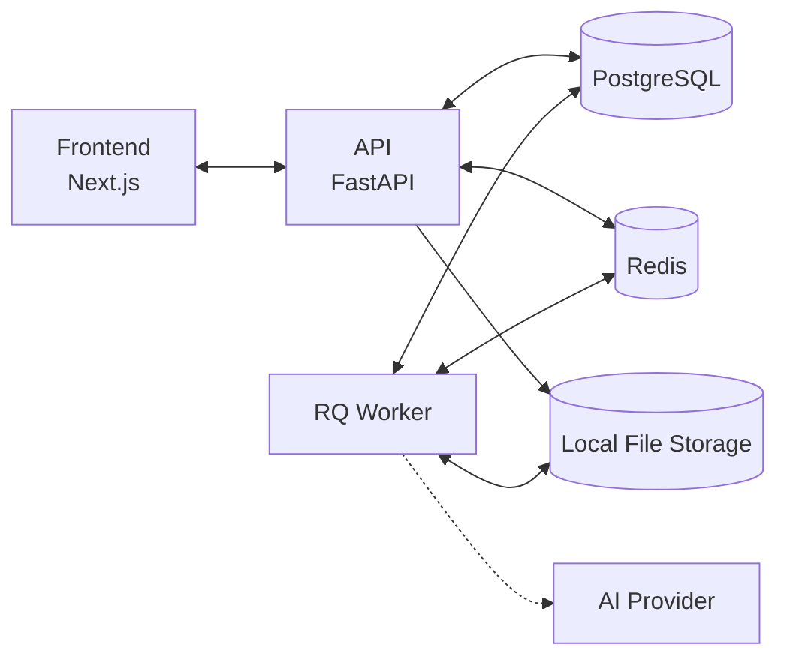

# MailRecon AI


**Evidence-First Email Threat Detection & Forensic Intelligence**

MailRecon AI is a platform designed for SOC analysts, incident responders, and email forensics professionals to quickly analyze, triage, and extract intelligence from suspicious emails (`.eml` files).

## Architecture



## Quick Start

1. Clone the repository:
   ```bash
   git clone <repo>
   cd Mail-Recon
   ```

2. Setup environment variables:
   ```bash
   cp .env.example .env
   # Edit .env and set SECRET_KEY to a secure random string
   ```

3. Start the application:
   ```bash
   docker compose up --build
   ```

- Frontend: [http://localhost:3000](http://localhost:3000)
- API: [http://localhost:8000](http://localhost:8000)
- API Docs: [http://localhost:8000/docs](http://localhost:8000/docs)

## Development Setup

To run locally outside of Docker:

**Backend:**
```bash
cd backend
python -m venv .venv
source .venv/bin/activate  # On Windows: .venv\Scripts\activate
pip install -e '.[dev]'
uvicorn app.main:app --reload
```

**Frontend:**
```bash
cd frontend
npm install
npm run dev
```

## Demo Fixtures

Synthetic `.eml` files are available in `backend/tests/fixtures/` for testing:
- `phishing_cred_harvest.eml`: Credential harvesting attempt.
- `malware_attachment.eml`: Contains a simulated malicious payload.
- `benign_newsletter.eml`: Standard benign communication.

## API Endpoints

| Method | Path | Description |
|--------|------|-------------|
| POST | `/api/v1/auth/token` | Login to get JWT token |
| POST | `/api/v1/cases` | Create a new case and upload `.eml` |
| GET | `/api/v1/cases` | List all cases for current analyst |
| GET | `/api/v1/cases/{id}` | Get case details |
| GET | `/api/v1/cases/{id}/download` | Download original evidence |

## Running Tests

```bash
cd backend
pip install -e '.[dev]'
pytest -v
```

## Project Structure

```
Mail-Recon/
├── backend/          # FastAPI application
├── frontend/         # Next.js web interface
├── docs/             # Documentation and models
├── docker-compose.yml
├── docker-compose.prod.yml
└── README.md
```

## Security

Please review the [Threat Model](docs/THREAT_MODEL.md) for detailed security considerations. Key principles include:
- No execution of email attachments.
- Sandboxed parsing of `.eml` files.
- Role-based isolation of case data.

## Limitations

- MVP / hackathon project status.
- AI integration is currently stubbed out (Phase 0).
- No real-time threat intelligence feeds integrated.
- GeoIP data is mocked.
- Designed for single-instance deployment.
- No automated email notifications.

## License

MIT License
