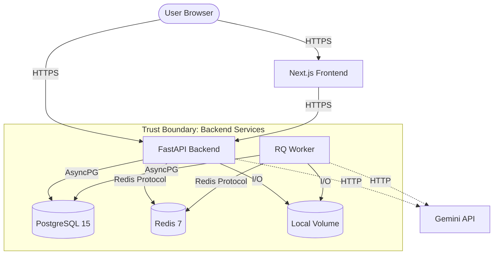

# MailRecon AI - Threat Model

**Version:** 0.1.0  
**Date:** 2026-09-10  
**Scope:** Phase 0 Architecture - API, Database, File Storage, and basic Frontend.

## System Overview

## Data Classification
- **Critical**: Original .eml files, parsed email content, analyst credentials
- **Sensitive**: Findings, indicators, risk scores
- **Internal**: Configuration, logs
- **Public**: Health endpoint, API schema

## STRIDE Analysis Table

| ID | Cat | Threat | Component | Risk | Mitigation | Status |
|----|-----|--------|-----------|------|------------|--------|
| T01 | Spoofing | Forged analyst identity | Auth | H | JWT with strong secret, bcrypt passwords | ✅ |
| T02 | Spoofing | Token theft via XSS | Frontend | H | HttpOnly cookies (future), CSP headers | ⬜ |
| T03 | Tampering | Evidence modification after upload | Storage | H | SHA-256 integrity verification on read | ⬜ |
| T04 | Tampering | SQL injection | API/DB | H | SQLAlchemy parameterized queries, Pydantic validation | ✅ |
| T05 | Repudiation | Analyst denies accessing case | Audit | M | Audit logging (planned) | ⬜ |
| T06 | Info Disclosure | Email content in logs | Logging | H | PII-filtered structured logging, no email bodies in logs | ✅ |
| T07 | Info Disclosure | Original .eml served without auth | Storage API | H | Auth-gated download, non-guessable storage keys | ✅ |
| T08 | Info Disclosure | Case data accessible cross-analyst | API | H | analyst_id ownership check on every case endpoint | ✅ |
| T09 | DoS | Zip-bomb / huge .eml upload | Ingestion | M | 25MB upload limit, MIME depth limit (10), timeout | ✅ |
| T10 | DoS | Decompression bomb in image | QR decoder | M | 10MB image decode limit, pixel dimension cap | ✅ |
| T11 | DoS | Resource exhaustion from many uploads | API | M | Rate limiting (planned), queue-based processing | ⬜ |
| T12 | EoP | Malicious .eml triggers code execution | Parser | H | No attachment execution, sandboxed parsing, no eval | ✅ |
| T13 | EoP | Prompt injection via email body | AI adapter | H | Email content treated as data input, output validation | ⬜ |
| T14 | EoP | SSRF via URL in email | Enrichment | H | No automatic URL fetching, manual analyst action only | ✅ |
| T15 | EoP | Path traversal in storage key | Storage | H | Key sanitization, path traversal prevention | ✅ |
| T16 | Tampering | Unsanitized HTML rendering | Frontend | H | bleach sanitization before storage, CSP headers | ✅ |
| T17 | Info Disclosure | Secrets in Docker image | Deployment | M | Multi-stage builds, .env not copied to image | ✅ |
| T18 | Info Disclosure | Email sent to external AI | AI adapter | H | Configurable AI provider, mock by default, explicit opt-in | ✅ |

## Trust Boundaries
- **External boundary**: User browser interacting with the frontend over HTTPS.
- **API boundary**: FastApi exposing REST endpoints, consuming requests with varying levels of trust.
- **Data boundary**: Postgres DB, Redis, and Storage volume that only the API and background workers can interact with directly.
- **External services boundary**: Gemini AI endpoints which handle data outbound from the system.

## Security Controls Checklist
- ✅ JWT Authentication
- ✅ Input Validation (Pydantic)
- ✅ Parameterized SQL Queries
- ✅ Role-Based Access Control (Analyst ownership)
- ✅ Upload Size Limits
- ✅ Path Traversal Prevention
- ⬜ Audit Logging
- ⬜ Secure Cookies
- ⬜ Rate Limiting
